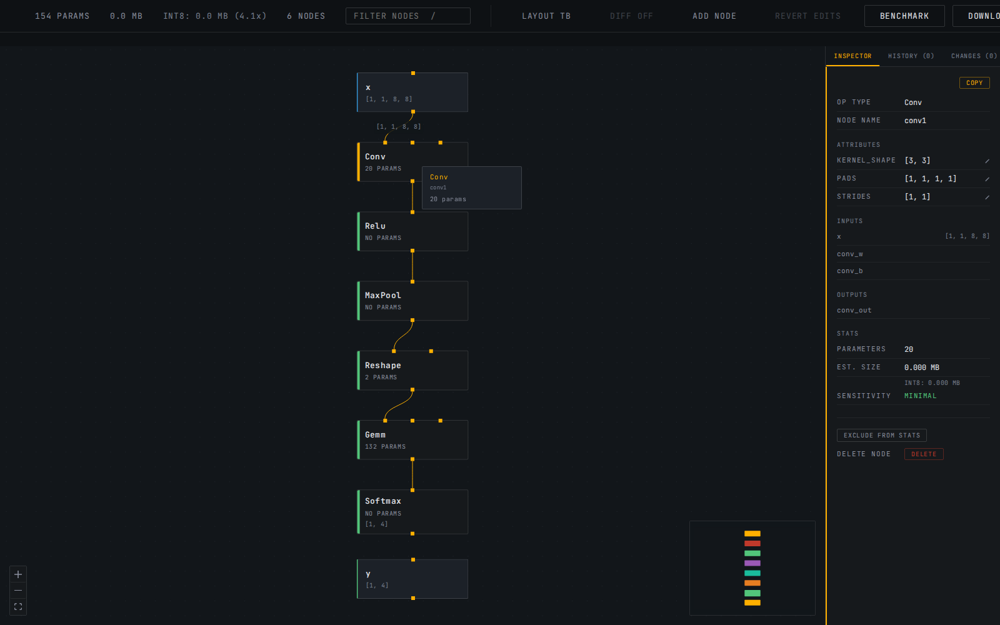
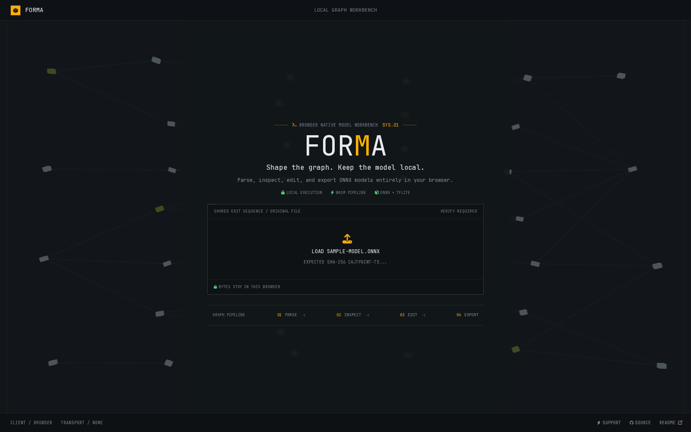

<div align="center">


# Forma

### Browser-Native ONNX & TFLite Graph Editor

**Inspect, edit, and export neural network models entirely in the browser. No Python. No server. No installation.**

[](LICENSE)
[](https://www.typescriptlang.org/)
[](https://react.dev/)
[](https://github.com/Hussain004/Forma/releases)

[**Live Application**](https://forma-ml.vercel.app) · [Issues](https://github.com/Hussain004/Forma/issues) · [Releases](https://github.com/Hussain004/Forma/releases)

</div>

---

## Overview

Forma is a fully client-side web application for loading, visualizing, and analyzing ONNX and TFLite neural network models. Drop a `.onnx` or `.tflite` file onto the canvas and the complete computation graph renders immediately: nodes laid out automatically with dagre, every tensor edge routed, each operator inspectable with a single click. ONNX models are fully editable and exportable; TFLite support is read-only.

All computation runs in the browser via WebAssembly. Models never leave the user's machine.
ONNX edit sequences can be shared through verified URL hashes without uploading model bytes.

<video src="https://github.com/user-attachments/assets/0d1304a3-9be0-495a-b6f5-7a2f6e422bb6" controls width="100%"></video>

## Screenshots

### Editor Workspace

The bundled sample model loaded locally with the Conv node selected and its editable attributes,
tensor shapes, parameter count, and graph context visible.



### Verified Share Link

A shared edit sequence requests the exact original model and displays its expected SHA-256
fingerprint before any edits are replayed.



---

## Capabilities

### Graph Visualization

- Drag-and-drop `.onnx` or `.tflite` loading with real-time progress indication
- Automatic dagre layout with TB (top-down) and LR (left-right) toggle, moved to a worker for large graphs with a synchronous fallback
- Large-graph layout runs off the main thread above 500 nodes, with a clear fallback if the worker cannot complete
- Desktop-first gate below 900px and first-load hint chips for editing gestures that are otherwise hard to discover
- Pan, zoom, and minimap navigation for large models
- Distinct visual treatment for operator nodes versus input/output tensor nodes
- Op category coloring: each node's left accent bar indicates its operator category (Convolution, Activation, Normalization, Linear, Pooling, Reshape, and more)
- Search dropdown: live-filtered results with keyboard navigation (arrow keys, Enter to jump, Escape to dismiss)
- Filter nodes by operator type, name, or tensor name with live dimming of non-matching nodes
- Keyboard shortcuts: `/` focuses the filter input, Escape clears and deselects, Ctrl/Cmd+Z undoes, Ctrl/Cmd+Shift+Z and Ctrl/Cmd+Y redo
- Hover tooltip: instant op type, parameter count, and output shape on mouse-over without clicking
- Edge shape labels: selecting a node shows tensor shapes on all edges directly connected to it

### Model Inspection

- Click any node to open the Layer Inspector with operator type, node name, parameter count, estimated weight size, tensor shape annotations, and full attribute listing (kernel size, strides, epsilon, group, auto_pad, and every other op attribute stored in the model)
- Inline attribute editing: click any attribute value to edit it directly; integer, float, string, and array attributes are all editable with type-aware parsing
- Structural editing: delete a node with automatic reconnection, or a picker to choose the reconnection source when it has multiple inputs; insert a passthrough Identity node by clicking any edge. A green "NEW" badge marks inserted nodes in the canvas
- Manual rewiring: drag a connection from any node's output to a specific input handle on another node to redirect that input; each input on a multi-input node (Add, Concat, etc.) gets its own handle so the drop target is never ambiguous. Forma rejects self-connections, cycles, and known tensor type, rank, or concrete-dimension conflicts while allowing symbolic or missing metadata
- Add custom node: place a new, initially unconnected node on the canvas from a curated op list or free-text entry, then wire its inputs and output into the graph with the same drag-to-connect gesture as manual rewiring. A green "NEW" badge marks it, same as an inserted passthrough
- Edit history: a tabbed timeline records attribute, structural, rewire, and add-node edits; jump to any point, undo, redo, or revert to the original model
- Diff view: toggle an original-versus-current overlay with ghosted deleted nodes, existing MOD and NEW badges, blue changed connections, dashed removed connections, and a copyable plain-text change log
- Modified badge: edited nodes are marked with a "MOD" indicator in the canvas and a "Modified" label in the inspector
- Ctrl/Meta+click for multi-select: build a selection across multiple nodes simultaneously
- Aggregate inspector: combined parameter count, total size, and op type breakdown when multiple nodes are selected
- Bulk exclude/include/delete: EXCLUDE ALL, INCLUDE ALL, and DELETE ALL buttons apply to the full selection at once (delete skips any node whose reconnection is ambiguous, same rule as the single-node Delete key)
- Ancestor/descendant trace: selecting a node highlights all upstream producers (blue accent) and downstream consumers (green accent), dimming unrelated nodes
- Op type histogram with graph depth: model-wide operator breakdown sorted by frequency, plus longest-path depth, shown when no node is selected
- Model metadata panel: producer name and version, opset version, and IR version shown in the summary view
- Category legend in model summary showing only operator categories present in the loaded model
- INT8 size estimate: projected model size after dynamic quantization, in the stats bar and per-node in the inspector
- Inference benchmark: forward pass in the WASM runtime with median latency across multiple trials
- Node exclusion: mark individual nodes as excluded; visual strikethrough applied to excluded cards

### Shareable Edit Links

- Share Edits copies the active ONNX edit sequence into a compact URL hash
- Model bytes and weights are never embedded in the link or uploaded anywhere
- Every link includes a SHA-256 fingerprint of the original model
- Opening a link prompts the recipient to load the original file from their own device
- Edits replay only after the browser verifies an exact fingerprint match
- Attribute edits, deletes, grouped bulk deletes, passthrough insertion, rewires, custom nodes, and canvas placement all round-trip through the link
- Replayed edits populate the normal history timeline and remain undoable, redoable, diffable, and exportable

### Behavioral Validation

- Run the original model and the current edits against identical inputs, side by side, entirely in ONNX Runtime Web in your browser
- Load reusable test inputs from a `.npy` file (single-input models) or a `.npz` archive (array names matched against graph input names); both the plain and DEFLATE-compressed `.npz` variants that `numpy.savez` produces are supported, decoded with the browser's native `DecompressionStream`
- No file loaded falls back to deterministic generated inputs -- reproducible across runs, but a smoke test, not real data, and labeled as such
- Per-output comparison: presence, shape match, max absolute error, max relative error, cosine similarity, and Top-K index agreement where the output shape makes that applicable
- A failed load or inference on either side is reported with the underlying onnxruntime error message, not just a pass/fail flag
- Results are recorded per edit state (by its actual sequence of applied edits, not by index), so switching between undo/redo/history-jump points recalls prior results instead of losing them
- Unavailable for read-only TFLite models, consistent with every other edit-related feature

### Minimal Repro Extraction

- Select a connected cluster of nodes (Ctrl/Meta+click or Shift+drag box-select) and choose Extract Repro to export just that piece as a standalone, valid ONNX file
- Boundary tensors -- anything a selected node reads that isn't produced inside the selection, or produces that isn't consumed inside it -- are promoted to fresh graph inputs and outputs automatically
- Weights the selection actually depends on are carried over as initializers; everything else from the original model is left out
- Reuses the original tensor's declared shape and type when one exists (an original graph input/output, or an intermediate tensor the model already annotated); otherwise falls back to an unranked float32 declaration
- Always extracts from the originally loaded model, not the current edit state, and always validates the result the same way Export Modified does: a real onnxruntime load, reported in the status line
- Requires the selection to be a single connected piece and made up only of original model nodes; either violation is rejected before anything is sent to the worker

### Deployment Surgery

- Rename a node or any tensor (an ordinary intermediate value, a graph input/output, or an initializer) inline in the Layer Inspector; a tensor rename updates every node that references it, not just the one you clicked
- Edit a graph input or output's declared element type and shape directly on its pseudo-node, including symbolic dimensions (e.g. a fixed batch size of 1 becoming a `batch` param) and dropping the shape entirely for a fully dynamic (unranked) declaration
- Promote any intermediate tensor to an additional graph output with one click, for inspecting or comparing an internal activation without restructuring anything else
- Small constants (a Reshape target shape, a scalar bias or threshold -- anything at or under 64 elements) are shown inline with their current values and editable the same way as an attribute; larger weight tensors are not, by design
- All five edit types are full history citizens: undoable, redoable, diffable, and reflected in the change log, the same as every earlier structural edit
- Not yet included in shareable edit links (v2.0's Share Edits) -- sharing an edit sequence containing one fails with a clear message rather than silently dropping it

### Pipeline Recipes

- A curated menu of common preprocessing recipes (Cast, Resize, Transpose, L2 Normalize) on any graph Input pseudo-node, and postprocessing recipes (Softmax, Sigmoid, Top-K, Transpose) on any graph Output pseudo-node -- one click inserts a fully wired node with sensible default attributes, ready to fine-tune like any other node
- Preprocessing recipes rewire every current consumer of the graph input (including fan-out to multiple nodes) to the new node's output, while the graph input's own declared name and type stay exactly as external callers expect
- Postprocessing recipes keep the graph output's declared name on the new node's output and rename whatever used to produce it to an internal tensor, so the public contract never moves
- Recipes chain: inserting a second recipe on the same boundary attaches after the first instead of both racing to intercept the same tensor, on both the live canvas and export
- Top-K adapts to the loaded model's own declared opset -- the modern two-input (data, K) encoding for opset 10+, the legacy `k`-as-attribute encoding below it -- since onnxruntime resolves op schemas against the model's own opset declaration, not a fixed one. Resize has no such fallback (it didn't exist before opset 10), so it's hidden entirely on an older model rather than failing at export
- A recipe that reduces or reshapes its output (Top-K, and any future one like it) drops the now-stale declared shape on the graph output it feeds rather than leaving a declaration onnxruntime's own shape inference would reject; dtype is preserved
- Detection postprocessing (NonMaxSuppression) is deliberately out of scope: it needs two pre-existing internal tensors (boxes and scores) as inputs, not one boundary tensor, so it doesn't fit this insert-at-a-boundary model

### Model Comparison

- Load two independent ONNX files (baseline and candidate) side by side and diff them without touching the main editor's edit history at all
- Structural diff: node counts, an op-type-count table restricted to types whose count actually changed, and full added/removed node lists
- Nodes are matched between the two files by name when every node on both sides has a unique one (true for most real exports); otherwise falls back to pairing the Nth occurrence of each op type on one side with the Nth on the other, and says which strategy was used
- Attribute diff on every matched node pair, initializer diff (added, removed, or changed shape/dtype, reconstructed from consumed-but-never-produced tensor names since initializers aren't a first-class list on the graph object), graph I/O diff (shape, dtype, added/removed), and metadata diff (opset, IR version, producer)
- Run Latency Comparison and Run Output Comparison drive two independent Web Workers (one per model) so a candidate that fails to load or infer never hides the baseline's real result, or vice versa
- Output comparison reuses the same max-abs-error/max-rel-error/cosine-similarity/Top-K math as Behavioral Validation, against a single-sided generated-input inference run
- Export Report downloads a plain-text summary of every section above, including latency and output numbers once run
- Export Edit Recipe appears only when the candidate is reachable from the baseline by attribute edits alone (matched by name, nothing structural added, removed, or reshaped). In that case the diff already *is* a Forma edit history, so it reuses the existing share-link mechanism verbatim: a verified URL that replays the exact attribute changes onto the baseline model when opened
- TFLite is rejected on either side with a clear message rather than silently producing an empty diff, consistent with TFLite being read-only everywhere else in the app

### TFLite Support (Read-Only)

- Format detected by the file's own identifier bytes, not just its extension, so drag-and-drop works correctly regardless of how the file is named
- Full graph visualization, category-colored nodes, tensor shapes, and weight sizes in the same canvas and Layer Inspector as ONNX -- no separate UI
- Read-only by design: no attribute editing, no node deletion or insertion, no Benchmark or Export Modified. A dim "TFLite read-only" badge in the stats bar makes this explicit; plain Download still works

### Export


- Download the original model buffer as exported by the WASM runtime
- Export Modified: write attribute edits and structural edits (deleted, inserted, rewired, or newly added nodes) back into a valid ONNX binary protobuf and download the patched model
- Initializer weight bytes are preserved byte-for-byte on export; only what changed is re-encoded, everything else passes through untouched
- Inserted, added, and rewired nodes are placed to preserve ONNX's required topological node order, so exported files pass strict validation, not just onnxruntime's own lenient loading
- Exported filename strips the original extension cleanly (e.g. `model_export.onnx`, never `model.onnx_export.onnx`)
- Modified ONNX exports are round-trip verified through onnxruntime before the result is reported in the status line
- Export is performed off-thread; the UI remains responsive throughout
- Copy node metadata to clipboard with a single button press in the Layer Inspector

### Engineering

- Off-main-thread ONNX inference via `onnxruntime-web` in a dedicated Web Worker
- Schema-aware binary protobuf parser for full graph metadata extraction
- Hand-written binary FlatBuffers parser for TFLite, independent of the protobuf parser -- a completely different wire format (table/vtable/offset-based rather than tag/varint-based), verified against the authoritative TFLite schema
- Byte-preserving protobuf writer: patches only the fields that changed, leaving everything else (including large initializer tensors) untouched; structural edits (node delete/insert/rewire/add) use an array-based rewrite that preserves topological node order, re-sorting via DFS postorder when a rewire or a newly added node connects to something serialized later in the original file
- Minimal-repro extraction reuses the writer's low-level protobuf primitives to build a fresh GraphProto (only the selected nodes, their required initializers, and synthesized or reused ValueInfoProto for promoted boundary tensors) while everything outside GraphProto still passes through byte-for-byte
- The writer's structural-edit path decodes GraphProto into four addressable pools (nodes, initializers, graph inputs, graph outputs) rather than nodes alone, so deployment-surgery and pipeline-recipe ops (rename, retype, promote, replace, insert-recipe) can rewrite any of them; everything else (value_info, doc_string, ...) still passes through untouched
- A pipeline-recipe node reuses the same addressable-node scheme as a custom-added one (a shared counter mints its negative `origIndex`), so it can be further attribute-edited, renamed, or deleted with no writer code beyond what custom nodes already needed; attribute overrides are now applied to the writer's final node set (after structural edits run, not before), which is what makes editing a freshly inserted node's attributes actually reach the export, not just the live canvas
- Fixed a pre-v2.4 bug in the AttributeProto field numbers for FLOAT and STRING attributes (`f`/`s`, not the `4`/`6` this parser used): every float or string attribute in every model ever loaded silently failed to parse rather than erroring, so nothing surfaced it until v2.4 needed to *write* a fresh string attribute (Resize's `mode`) and the wrong field number produced bytes onnxruntime's strict protobuf decoder rejected outright
- Both parsers build the same graph representation through a shared generic layer, so the graph canvas and inspector need no format-specific code
- Typed postMessage protocol between hook and worker with structured error propagation
- `SharedArrayBuffer` multi-threading via COOP/COEP headers
- Compact, versioned share-link codec with strict URL validation and browser-native SHA-256 verification
- Hand-written `.npy`/`.npz` reader (no zip library dependency): a minimal central-directory ZIP walk plus the browser's native `DecompressionStream` for DEFLATE entries
- Model Comparison runs two full `useOnnxWorker` instances (two real Web Worker threads) rather than one, so the baseline and candidate load, benchmark, and infer with fully independent onnxruntime-web sessions; the worker gained one new message, `RUN_GENERATED`, a single-sided version of the existing VALIDATE handler's internal generated-input inference path, reused as-is rather than duplicated
- Two session-creating actions (Benchmark and Output Comparison) sharing one worker instance are mutually exclusive in the UI: onnxruntime-web's WASM backend rejects a second concurrent `InferenceSession.create()` on the same worker thread with a "Session already started" error, found by driving the real UI end to end, not by unit tests alone
- 406 tests across 26 files; zero TypeScript errors on strict mode

---

## Quick Start

### Use the Live Application

1. Open [**forma-ml.vercel.app**](https://forma-ml.vercel.app)
2. Drag any `.onnx` model file onto the canvas
3. Click any node to inspect it in the Layer Inspector panel
4. Make an edit and choose Share Edits to copy a verified edit link

### Run Locally

```bash
git clone https://github.com/Hussain004/Forma.git
cd Forma
npm install
npm run dev
```

Open [http://localhost:5173](http://localhost:5173).

**Requirements:** Node.js 18+. No Python, no CUDA, no native extensions.

---

## Architecture

```
Browser (main thread)
|
+-- App.tsx
|     useOnnxWorker hook    (status: idle -> loading -> ready -> benchmarking -> exporting)
|     SelectableGraph state (pure immutable transforms: selectNode, filterGraph, excludeNode)
|     |
|     +-- GraphCanvas       React Flow, dagre layout, OperatorNode + IONode, MiniMap, hover tooltip
|     |
|     +-- LayerInspector    Per-node detail, multi-select aggregate, model summary histogram
|     |
|     +-- ModelDropzone     Drag-and-drop with progress bar
|     |
|     +-- shareLinks.ts     Compact edit codec, SHA-256 verification, safe history replay
|
|                           postMessage (ArrayBuffer transfer, zero-copy)
|
+-- onnxWorker.ts (Web Worker)
      onnxruntime-web WASM (ONNX only)
      isTfliteBuffer()  -> format sniff, decides which parser + whether to create a session
      parseOnnxGraph() / parseTfliteGraph()  -> OnnxNode[], OnnxEdge[], graphInputs (shapes)
      LOAD_MODEL        -> MODEL_LOADED + QUANTIZE_ESTIMATE
      BENCHMARK         -> BENCHMARK_RESULT (ONNX only, no TFLite runtime exists)
      EXPORT            -> EXPORT_RESULT (ArrayBuffer transfer)
      EXPORT_MODIFIED   -> EXPORT_RESULT (attribute and structural edits patched into the original buffer, ONNX only)
      VALIDATE          -> VALIDATION_RESULT (two throwaway sessions -- original bytes and patched bytes -- run against identical inputs; comparison math runs back on the main thread)
      EXTRACT_SUBGRAPH  -> EXPORT_RESULT + VERIFY_RESULT (selected original nodes only, boundary tensors promoted to graph I/O, verified the same way as EXPORT_MODIFIED)
```

**Web Worker isolation:** WASM model loading and inference are blocking operations. Isolating them in a worker keeps the UI at 60 fps regardless of model size. The `useOnnxWorker` hook exposes a clean async interface with typed status transitions.

**No backend:** The entire pipeline runs in the browser. Zero infrastructure, zero server latency, models never leave the user's machine.

**COOP/COEP headers:** `SharedArrayBuffer` requires a cross-origin isolated context. Both `Cross-Origin-Opener-Policy: same-origin` and `Cross-Origin-Embedder-Policy: require-corp` are set via `vercel.json` on every response.

---

## Project Structure

```
src/
  components/
    GraphCanvas.tsx       React Flow canvas, dagre layout, MiniMap, JumpController, hover tooltip
    LayerInspector.tsx    Per-node detail, aggregate multi-select view, model summary histogram
    HistoryPanel.tsx       Timeline of applied and redoable edits with point-in-time navigation
    ChangeLogPanel.tsx     Copyable plain-text summary of the active edit-history prefix
    ModelDropzone.tsx     Drag-and-drop with progress indication
    ModelComparePage.tsx  Two-file model comparison view: independent baseline/candidate
                          drop slots, structural diff rendering, latency/output comparison
                          triggers, report and edit-recipe export
  hooks/
    useOnnxWorker.ts      Typed React hook wrapping the ONNX Web Worker
  lib/
    onnxTypes.ts          Graph interfaces plus aligned per-input and per-output tensor metadata
    onnxProtoParser.ts    Binary protobuf parser for ONNX ModelProto
    onnxProtoWriter.ts    Byte-preserving protobuf writer: attribute edits, node delete/insert
    tfliteParser.ts       Binary FlatBuffers parser for TFLite (read-only): FlatBufferReader,
                          BuiltinOperator name table, tensor-index-to-name translation
    onnxParser.ts         buildGraphFromParsed() -- generic ParsedGraph -> OnnxGraph builder
                          shared by both the ONNX and TFLite parsers
    attrUtils.ts          inferAttrType, parseAttrEdit -- attribute type inference and parsing
    graphUtils.ts         Pure graph transforms: selection, filter, exclusion, tracing, depth,
                          delete eligibility, delete-with-reconnect, passthrough insertion,
                          rewire validation (cycle, self-connect, tensor compatibility), edge
                          rewiring, addCustomNode, insertRecipeNode (chain-aware boundary
                          insertion for pipeline recipes), currentInputBoundaryTensor
                          and the curated op-type menu, structuralNodeIndex (unifies original,
                          custom-added, and recipe node addressing), OP_CATEGORIES (ONNX + TFLite
                          op names), and buildGraphDiff for the original-versus-current overlay
    pipelineRecipes.ts    Curated preprocessing/postprocessing recipe catalog (Cast, Resize,
                          Transpose, L2 Normalize, Softmax, Sigmoid, Top-K) and resolveRecipe,
                          which adapts a recipe to the loaded model's declared opset
    shareLinks.ts         Compact URL-hash codec, model fingerprinting, input validation,
                          and verified history reconstruction
    subgraphExtractor.ts  Minimal-repro extraction: selected-nodes-only GraphProto rebuild
                          with boundary tensors promoted to fresh graph inputs/outputs
    modelComparison.ts    Pure structural diff between two independently loaded OnnxGraphs:
                          node matching (by name or op-type position), attribute/initializer/
                          graph-I/O/metadata diffs, plain-text report formatting, and the
                          attribute-only edit-recipe check
    quantize.ts           INT8 size estimation and formatting
  workers/
    onnxWorker.ts         Web Worker: LOAD_MODEL (format-sniffed), BENCHMARK, EXPORT, EXPORT_MODIFIED
  __tests__/
    graph.test.ts         Graph utilities and selection model
    onnx.test.ts          Worker lifecycle and message contract
    app.test.tsx          App integration: load flow, selection, error states
    v3.test.ts            Filter, exclusion, INT8 estimation
    v4.test.ts            Export reliability, quantize formatting, download
    v0.5.test.ts          computeOpCounts, keyboard shortcuts, op histogram
    v0.6.test.ts          opCategoryColor, getAncestors/getDescendants, computeGraphDepth
    v0.7.test.ts          setMultiSelection, bulkExclude/bulkInclude, aggregate inspector
    v0.8.test.ts          layout toggle, search dropdown, clipboard copy, benchmark types
    v0.9.test.ts          attribute viewer, tensor name search, edge shape labels
    v0.10.test.ts         model metadata, node name, producer/opset/IR version parsing
    v1.0.test.ts          attribute type inference, value parsing, inline editing, MOD badge
    v1.1.test.ts          protobuf writer: int/float/string/array attribute edits, byte preservation
    v1.2.test.ts          structural editing: delete/insert eligibility, reconnection, topological order
    v1.3.test.ts          TFLite: format detection, FlatBuffers fixture round-trip, opcode fallback
    v1.4.test.ts          Manual rewiring: cycle/self-connect validation, writer topological
                          re-sort, bulk delete UI
    v1.5.test.ts          Add custom node: writer addNode round-trip, custom-node topological
                          placement in both wiring directions, structuralNodeIndex addressing,
                          Add Node picker UI (curated pick and free text)
    v1.6.test.ts          History labels and panel state, undo/redo, jumps, reset, and redo truncation
    v1.7.test.ts          Graph diff metadata, ghost rendering, change-log copy, and overlay state
    v1.8.test.ts          Tensor metadata alignment, rewire compatibility, and rejection feedback
    v2.0.test.tsx         Share codec, hashing, validation, verification, replay, and clipboard flow
    v2.1.test.tsx         NPY/NPZ parsing, output comparison math, validation panel UI
    v2.2.test.tsx         Subgraph extraction: boundary promotion, connectivity checks, writer round-trip
    v2.3.test.tsx         Deployment surgery: rename/retype/promote/replace writer ops and UI wiring
    v2.4.test.tsx         Pipeline recipes: writer insertRecipe (chaining, extra inputs/outputs,
                          opset adaptation), graphUtils insertRecipeNode, and recipe-picker UI
    v2.5.test.tsx         Model comparison: node matching, attribute/initializer/I-O/metadata
                          diffs, report formatting, edit-recipe eligibility, and the compare
                          page's dual-worker wiring (loading, latency, output comparison,
                          edit-recipe export, TFLite rejection)
```

---

## Development

```bash
npm run dev      # Dev server with COOP/COEP headers
npm test         # 406 tests across 26 files
npx tsc --noEmit # Type-check without building
npm run build    # Production build
```

---

## Releases

| Version | Scope |
|---|---|
| 2.5.0 | Model comparison: load a baseline and candidate ONNX file side by side, diff graph structure, attributes, initializers, and I/O, compare latency and outputs via two independent Web Workers, and export a report or (attribute-only diffs) an applicable edit-recipe share link |
| 2.4.0 | Pipeline recipes: guided, chainable insertion of preprocessing (Cast, Resize, Transpose, L2 Normalize) and postprocessing (Softmax, Sigmoid, Top-K, Transpose) ops at any graph boundary, opset-adaptive |
| 2.3.0 | Deployment surgery: rename nodes and tensors, edit graph I/O names/shapes/symbolic dims/data types, promote intermediate outputs, inspect and replace small constants |
| 2.2.0 | Minimal reproductions: extract a selected connected subgraph as a standalone, validated ONNX file with boundary tensors promoted to graph I/O |
| 2.1.0 | Behavioral validation: run the original and edited model against identical `.npy`/`.npz` or generated inputs and compare outputs |
| 2.0.0 | Shareable URL-hash edit sequences with SHA-256 original-model verification and automatic history replay |
| 1.8.0 | Rewire tensor compatibility validation for known types, ranks, and concrete dimensions |
| 1.7.0 | Original-versus-current graph diff overlay and copyable plain-text change log |
| 1.6.0 | Unified edit history with undo, redo, jump-to-any-point timeline, and revert-to-original controls |
| 1.5.0 | Add custom node: curated op list or free text, wired into the graph via drag-to-connect, writer support for inserting an arbitrary node with correct topological placement |
| 1.4.0 | Manual rewiring: drag-to-connect any output to a specific input handle, cycle/self-connect validation, bulk delete for multi-select |
| 1.3.0 | TFLite support (read-only): binary FlatBuffers parser, shared graph/canvas/inspector with ONNX |
| 1.2.0 | Structural editing: delete a node with reconnection, insert a passthrough node, both exportable |
| 1.1.0 | Protobuf writer, Export Modified button, byte-preserving attribute patching |
| 1.0.0 | Inline attribute editing, Ctrl+Z undo, MOD badge on edited nodes |
| 0.10.0 | Model metadata (producer, opset, IR version), node names, 3-color favicon |
| 0.9.0 | Attribute viewer, tensor name search, edge shape labels, intermediate tensor shapes |
| 0.8.0 | Layout toggle (TB/LR), search dropdown, clipboard copy, benchmark type fix |
| 0.7.0 | Multi-select, aggregate inspector, bulk exclude/include, hover tooltip |
| 0.6.0 | Op category coloring, ancestor/descendant trace, graph depth stat |
| 0.5.1 | Stacked layers favicon, README rewrite |
| 0.5.0 | MiniMap, jump-to-node, keyboard shortcuts, op type histogram |
| 0.4.0 | INT8 estimate in UI, Download button, export promise hardening |
| 0.3.0 | Graph filter, node exclusion, INT8 size estimate, model export |
| 0.2.1 | Icon update, session guide |
| 0.2.0 | Schema-aware protobuf parser, sensitivity coloring, inference benchmark |
| 0.1.0 | MVP: ONNX loading, graph visualization, Layer Inspector |

---

## Limitations

- **ONNX and TFLite only.** PyTorch `.pt`, `.safetensors`, and other formats are not supported. Convert to ONNX first using `torch.onnx.export` for full editing support.
- **TFLite is read-only.** No attribute editing, structural editing, benchmarking, or Export Modified -- visualization and inspection only. Editing TFLite models is not planned; ONNX remains the primary edit-and-export format.
- **TFLite per-op attributes are not shown.** Decoding them requires walking ~100 distinct per-operator-type FlatBuffers schemas (Conv2DOptions, Pool2DOptions, etc.), which is out of scope for the initial read-only viewer. Topology, tensor shapes, and weight sizes are all shown; op-specific parameters (e.g. Conv2D stride) are not yet.
- **Graph internals depend on runtime exposure.** `onnxruntime-web` does not expose a public API for reading graph node metadata. Forma uses a schema-aware binary parser as the primary path with a runtime-extraction fallback.
- **INT8 estimates are projections.** The quantization size figures are computed analytically from parameter counts, not from running a quantizer. They are labeled as estimates.
- **Share links do not contain the model.** A recipient must have the exact original ONNX file. Forma verifies its SHA-256 fingerprint before replaying any edits.

---

## Acknowledgments

- [ONNX Runtime](https://onnxruntime.ai/) for the WebAssembly inference backend
- [React Flow](https://reactflow.dev/) for the interactive graph rendering primitives
- [dagre](https://github.com/dagrejs/dagre) for automatic directed graph layout

---

<div align="center">

Built for ML engineers who need to understand and optimize their models without leaving the browser.

If Forma is useful to you, consider [supporting development](https://donatr.ee/hussain/).

</div>
